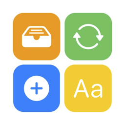

<h3>👋 Hi, I'm Ungjae Lee</h3>

<strong>iOS Developer building production apps, SwiftUI architecture, and developer tools</strong>

  I build and ship production iOS apps — from feature development and app architecture to SwiftUI APIs, native integrations, and reusable UI systems.

  Currently working on <strong>iOS engineering</strong> at <a href="https://www.overdare.com/">OVERDARE</a>, across production screens, SwiftUI-based systems, and native integration.

   

 

<h3>🍎 Focus</h3>

  <code>iOS App Development</code> ·
  <code>SwiftUI Architecture</code> ·
  <code>Native Integration</code> ·
  <code>API Design</code> ·
  <code>Developer Tools</code> ·
  <code>UI Systems</code>

 

<h3>💡 Apps</h3>

<table align="center">
  <tr>
    <td align="center" width="140">
      <a href="https://apps.apple.com/kr/app/pixi-layout/id6752223048">
         
        Pixi
      </a>
    </td>
    <td align="center" width="140">
      <a href="https://apps.apple.com/kr/app/dropui/id6450929988">
         
        DropUI
      </a>
    </td>
    <td align="center" width="140">
      <a href="https://apps.apple.com/kr/app/%ED%8E%98%EC%9D%B4%EB%A7%B5-%EC%A3%BC%EB%B3%80-%EA%B0%80%EA%B2%8C-%ED%8E%98%EC%9D%B4-%EC%A7%80%EB%8F%84/id6446371801">
         
        PayMap
      </a>
    </td>
    <td align="center" width="140">
      <a href="https://apps.apple.com/kr/app/%ED%8A%B8%EB%A0%8C%EB%94%94/id1615275308">
         
        Trendy
      </a>
    </td>
  </tr>
</table>

 

<h3>📚 Stack & Tools</h3>

  
  
  
  
  

---

### 🚀 Projects

- 🧩 **[RichText](https://github.com/NuPlay/RichText)** — SwiftUI text rendering framework with a developer-friendly API.
- 🏆 **[DropUI](https://github.com/NuPlay/DropUI)** — WWDC Swift Student Challenge Winner 2023, a developer tool for exploring SwiftUI.
- ✨ **[AnimationKit](https://github.com/NuPlay/AnimationKit)** — Declarative sequential animations for SwiftUI.
- 🤖 **[AutoL10N](https://www.linkedin.com/posts/ungjae-lee-393112241_krafton-ai-hackathon-share-7424087196883824641-8a-S)** — KRAFTON AI Hackathon Mentors' Pick, Figma-to-L10N automation with RAG and GPT integration.

